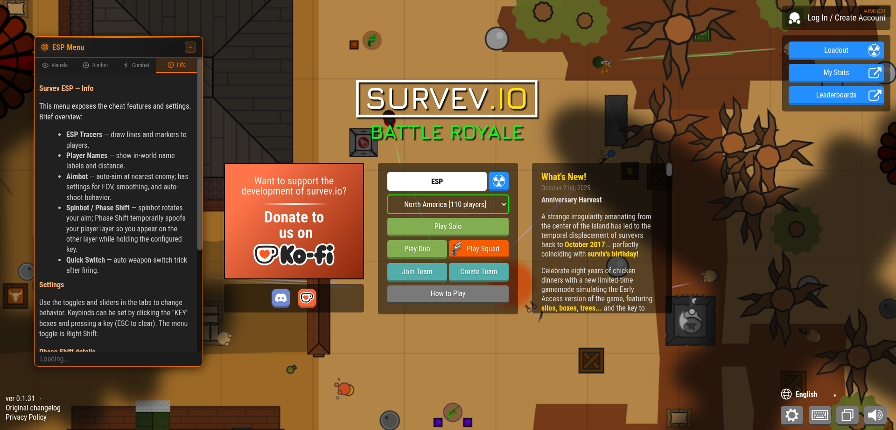
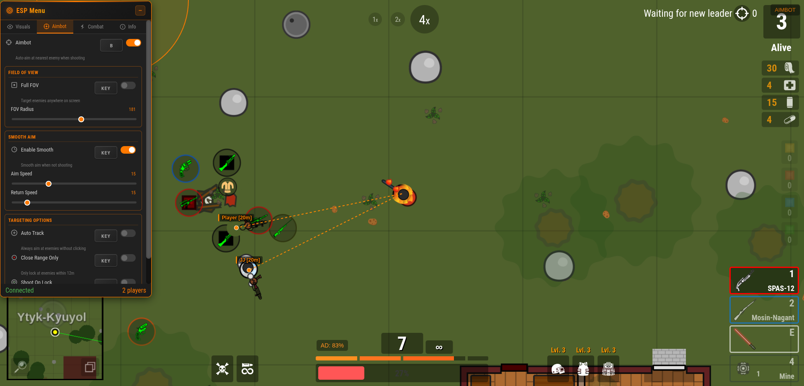
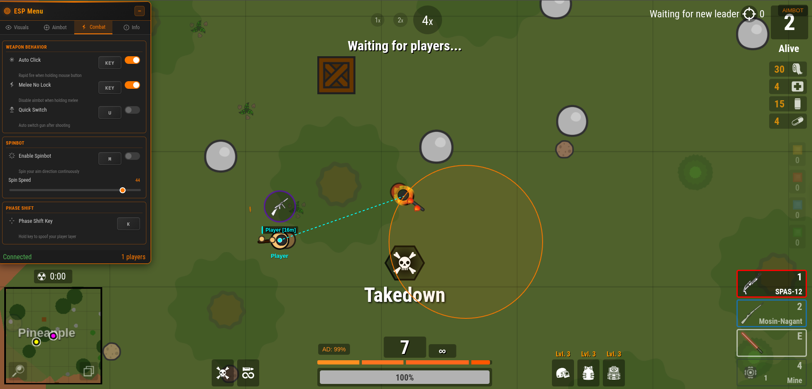
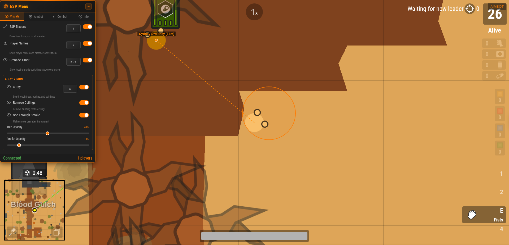
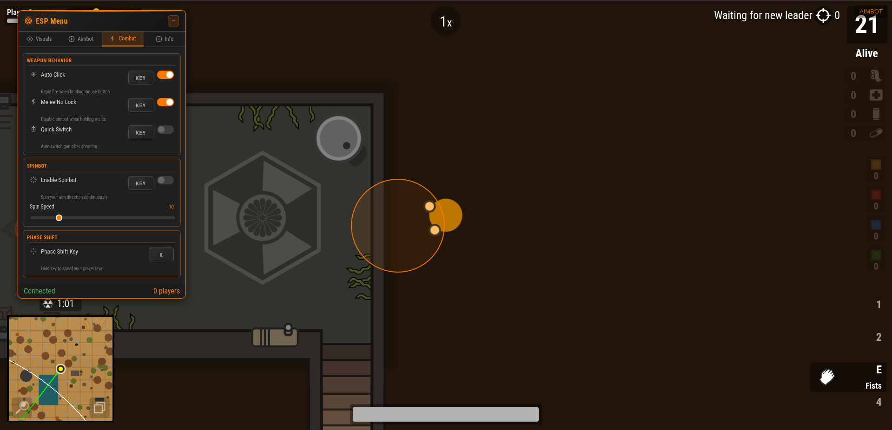
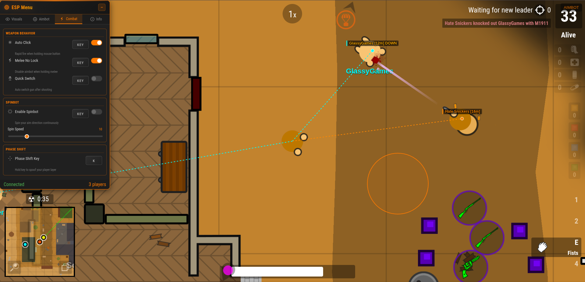

# HAGS - Game Enhancement Script

A feature-rich userscript for enhanced gameplay experience, built with JavaScript for use with Tampermonkey.

## 📸 Screenshots

| | | |
|:---:|:---:|:---:|
|  |  |  |
|  |  |  |

## ✨ Features

### 🎯 Aimbot
- Smart target acquisition with FOV-based detection
- Configurable aim speed and smoothing
- Close-range only mode
- Melee weapon exclusion option
- Auto-click functionality

### 👁️ ESP (Extra Sensory Perception)
- Player ESP with name labels
- Distance indicators
- Team detection to avoid friendly targeting
- Customizable visual overlays

### 🔮 X-Ray Vision
- See through obstacles
- Adjustable transparency levels for:
  - Trees
  - Obstacles
  - Smoke grenades
- Ceiling removal option

### 💣 Grenade Timer
- Visual countdown for grenades
- Never get caught off guard

### 🌀 Spinbot
- Configurable spin speed
- Toggle on/off easily

### ⚡ Quick Switch
- Rapid weapon switching capability

### 🎮 In-Game Menu
- Sleek, draggable UI
- Easy toggle controls for all features
- Settings persistence across sessions
- Customizable hotkeys

## 🛠️ Installation

### Option 1: Install from Greasy Fork (Recommended)

1. **Install Tampermonkey** for your browser:
   - [Chrome](https://chrome.google.com/webstore/detail/tampermonkey/dhdgffkkebhmkfjojejmpbldmpobfkfo)
   - [Firefox](https://addons.mozilla.org/en-US/firefox/addon/tampermonkey/)
   - [Edge](https://microsoftedge.microsoft.com/addons/detail/tampermonkey/iikmkjmpaadaobahmlepeloendndfphd)

2. **Go to the Greasy Fork page:**
   
   

3. **Click "Install this script"**

4. **Done!** The script will auto-update when new versions are released

---

### Option 2: Manual Installation

1. **Install Tampermonkey** for your browser (links above)

2. **Click the Tampermonkey icon** in your browser toolbar

3. **Click "Create a new script..."**

4. **Open the `survev-script.js` file** from this project

5. **Copy all the code** from the file

6. **Paste the code** into the Tampermonkey editor (replace any existing content)

7. **Press `Ctrl + S`** to save the script

8. **Done!** The script will now run automatically when you visit the game

### Patch note
- 1/16/2026
  ESP Line
  Players Names
- 1/18/2026 
  Aim Bot
  Melee Lock
